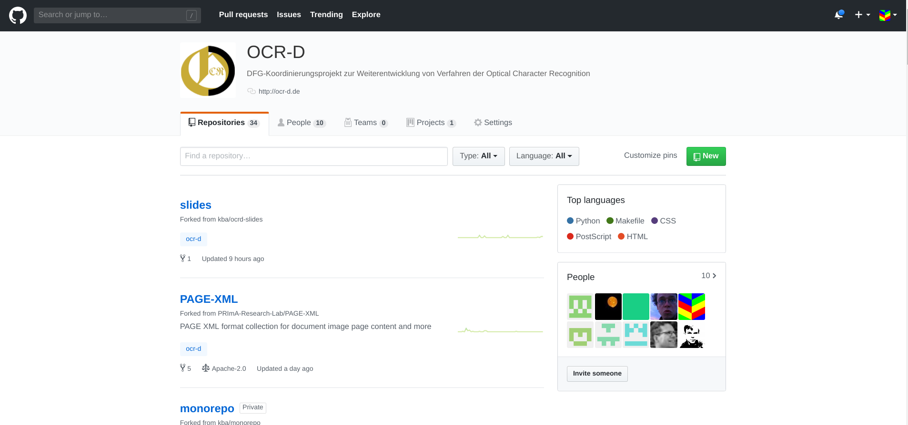
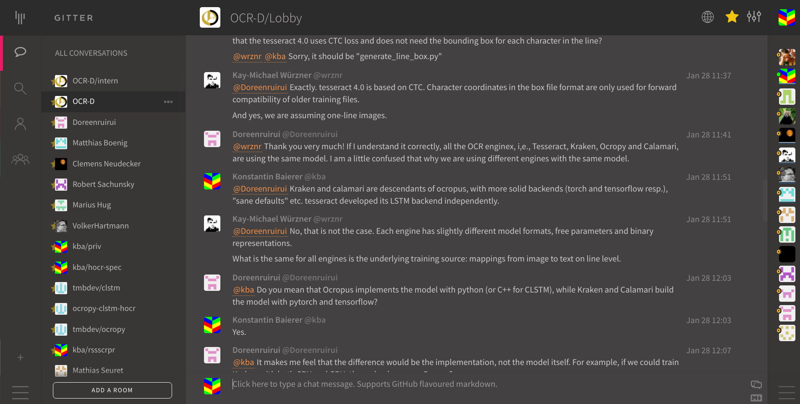
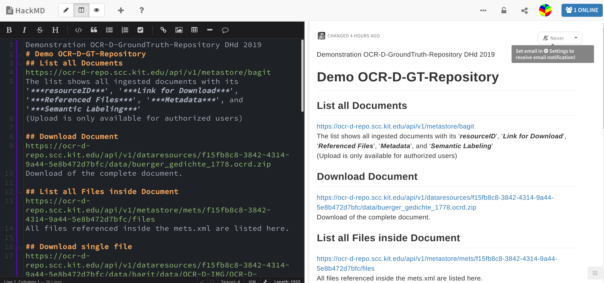
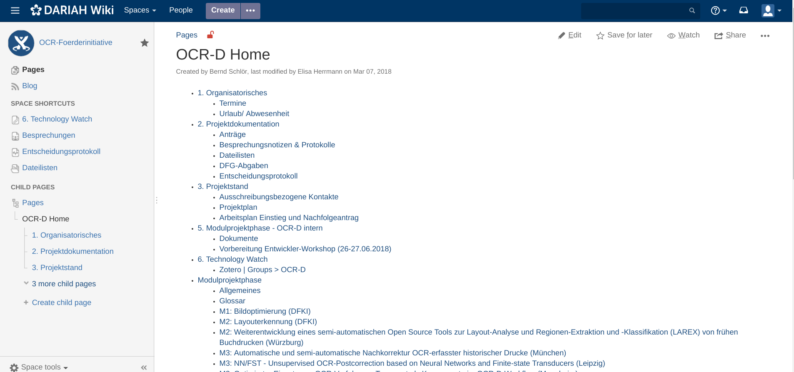
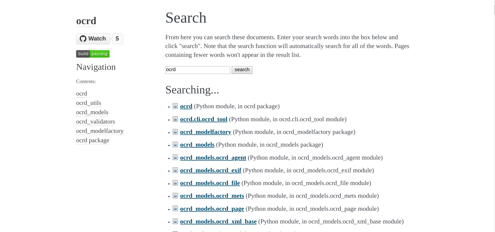

layout: true
  

  <table>
    <tr>
      <td style="text-align:left"><a href="http://ocr-d.github.io/slides/2019-03-25-dhd">http://ocr-d.github.io/slides/2019-03-25-dhd</a></td>
      <td style="text-align:right"><a href="https://ocr-d.de">OCR-D@DHd2019</a></td>
    </tr>
  </table>

---

class: title-slide

# OCR-D@DHd2019

## OCR-D Spezifikationen und Software

| Konstantin Baierer                                                                   |
| :-------------------------------------------:                                        |
| [konstantin.baierer @gmail.com](mailto:konstantin.baierer@gmail.com) |

## &nbsp;

# [http://ocr-d.github.io/slides/2019-03-25-dhd](http://ocr-d.github.io/slides/2019-03-25-dhd)

---

# Übersicht

* Projektphilosophie
* Spezifikationen
* Software
* Support

---

# Projektphilosophie

* Transparenz in Entwicklung und Kommunikation
* Modularität: Keine Black Boxes
* Spezifikation > Implementierung
* Standards nachnutzen
* Fokus: Massendigitalisierung
* "Upstream/Downstream" beitragen wenn möglich

---

background-image: url(figures/ocrd-diagram.png)

# Modularität

---

# Tools

| |
| --- | --- |
|  | | |
| GitHub (code, issues) | gitter (chat) |
|  | | |
| hackmd (text) | confluence (wiki) |

---

# Spezifikationen

https://ocr-d.github.io

---

# Spezifikationen - Dateiformate

* METS als Containerformat
  * Realität in den Bibliotheken und Archiven
  * Mächtig und flexibel (Fluch und Segen)
* PAGE-XML
  * Forschungsnah
  * Mächtiges Format
  * Gute Maintainenance
* OCRD-ZIP
  * BagIt-basiertes Austauschformat
  * Für GT und Ergebnisse

---

# Spezifikationen - Kommandozeile

* Kleinster gemeinsamer Nenner
* Uniformes Interface
  * Alle Werkzeuge werden gleich angesprochen
  * Eingabe: METS + PAGE-XML
  * Ausgabe: METS + PAGE-XML

---

# Spezifikationen - Deployment

* `ocrd-tool.json`
  * Beschreibung der Kommandozeilentools
  * Parameter
  * Dokumentation
* Dockerfile
  * Ausliefern der Werkzeuge als Docker-Container
  * Skalierbares Deployment

---

# Software

https://github.com/OCR-D

---

# Software - core

* Python 3
* Referenzimplenmentierung der Spezifikationen
* Werkzeuge für modulprojektübergreifende Aufgaben
  * Validierung
  * Dateimanagement
  * API für PAGE-XML, METS, EXIF
* Kommandozeilentool um Werkzeuge ohne Python zu nutzen

---

# Software - "Modulprojekte" des Koordinierungsprojektes

* ocrd_tesserocr
* ocrd_kraken
* ocrd_ocropy
* ocrd_olena
* ocrd_im6convert
* ocrd_calamari
* ...

---

# Software - Contributions

* ocrd-train
* mollusc
* ocropy
* calamari
* ocrd

---

# Support

* gitter - schnellste Variante
* Issues in GitHub - auch für Support
* E-Mail

---

# Vielen Dank

https://ocr-d.de

https://ocr-d.github.io

https://github.com/OCR-D

