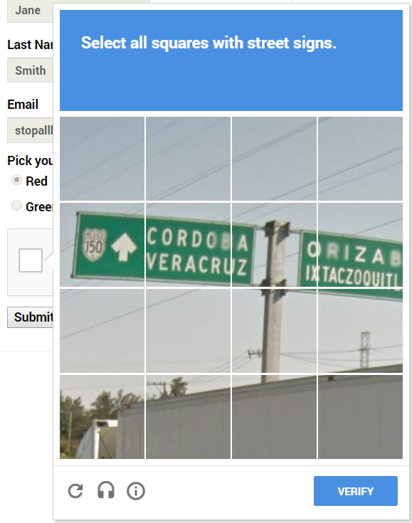
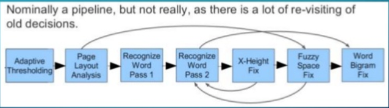
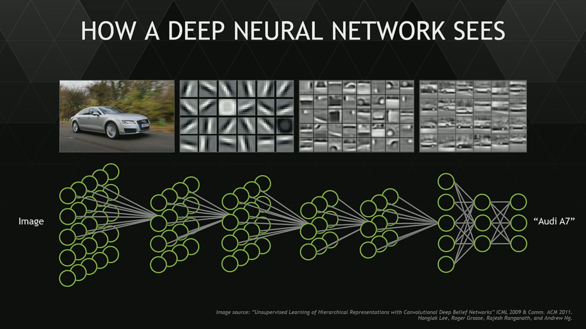
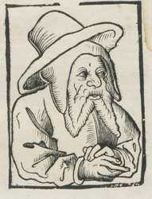

layout: true
  
<div class="my-header"></div>

<div class="my-footer">
  <table>
    <tr>
      <td style="text-align:left"><a href="http://kba.cloud/dh-2019-02-06">http://kba.cloud/dh-2019-02-06</a></td>
      <td style="text-align:right"><a href="https://ocr-d.de">OCR-D Stand Februar 2019</a></td>
    </tr>
  </table>
</div>

---

class: title-slide

# OCR-D - Stand Februar 2019

| Konstantin Baierer                                                                   |
| :-------------------------------------------:                                        |
| [konstantin.baierer @gmail.com](mailto:konstantin.baierer@gmail.com) |

## &nbsp;

## [http://kba.cloud/dh-2019-02-06](http://github.com/kba/dh-2019-02-06)


<!-- {{{ Definitionen -->

---

---

# "Optical Character Recognition" #2

---

# "Workflow"

  > **Workflow** um auf Grundlage eingescannter Rasterbilddaten Layout und Inhalt
  > eines Dokuments möglichst wirklichkeitsgetreu mit Markup abzubilden

1. Vorverarbeitung
2. Layout- und Texterkennung
3. Nachkorrektur
4. Ggf. Strukturerkennung

---

# "eingescannter Rasterbilddaten"

  > Workflow um auf Grundlage **eingescannter Rasterbilddaten** Layout und Inhalt
  > eines Dokuments möglichst wirklichkeitsgetreu mit Markup abzubilden

- Hochauflösend, mind. 300 dpi
- Unbearbeitet, unkomprimiert, verläsliche technische Metadaten
- vgl. [DFG-Praxisregeln]()

---

# "Layout" grob

  > Workflow um auf Grundlage eingescannter Rasterbilddaten **Layout** und
  > Inhalt eines Dokuments möglichst wirklichkeitsgetreu mit Markup abzubilden

- Seite vs. Hintergrund
- Druckbereich vs. Rand
- Text vs. Nicht-Text

---

# "Layout" fein

  > Workflow um auf Grundlage eingescannter Rasterbilddaten **Layout** und
  > Inhalt eines Dokuments möglichst wirklichkeitsgetreu mit Markup abzubilden

- Klassifikation der Blöcke (bspw "Marginalie", "Tabelle")
- Spalten und andere grobe Strukturen
- Zeilen

---

# "Inhalt"

  > Workflow um auf Grundlage eingescannter Rasterbilddaten Layout und
  > **Inhalt** eines Dokuments möglichst wirklichkeitsgetreu mit Markup abzubilden

- Innerhalb von Zeilen
- Ggf. nach Worten und oder Zeichen segmentiert
- Kodieren der Zeichen in Unicode

---

# "Dokuments"

  > Workflow um auf Grundlage eingescannter Rasterbilddaten Layout und
  > Inhalt eines **Dokuments** möglichst wirklichkeitsgetreu mit Markup abzubilden

- Gedruckte Schrift, nicht Handschriften
- Monographien
- perspektivisch: Zeitungen

---

# "möglichst wirklichkeitsgetreu"

  > Workflow um auf Grundlage eingescannter Rasterbilddaten Layout und
  > Inhalt eines Dokuments **möglichst wirklichkeitsgetreu** mit Markup abzubilden

- Evaluation der Qualität der OCR
- Feedback zur Verbesserung
- Computerlinguistische Methoden

---

# "Markup"

  > Workflow um auf Grundlage eingescannter Rasterbilddaten Layout und Inhalt
  > eines Dokuments möglichst wirklichkeitsgetreu mit **Markup** abzubilden

- XML-basiert: **ALTO**, PAGE-XML, ABBYY XML
- HTML-basiert: hOCR
- Als Containerformat: METS

---

# OCR weithin interessant


<!-- }}} -->

---

# Projekt OCR-D

* Koordinierungsprojekt (BBAW, SBB, HAB Wolfenbüttel, KIT Karlsruhe)
* 8 Modulprojekte zu verschiedenen Themen
* 3 Phasen: Standortbestimmung (2015-2017), Prototypisierung (2017-2018), Implementierung (2018-2019)
* Unser Fokus im Moment:
  * Spezifikationen
  * Ground Truth
  * Qualitätssicherung

---

background-image: url(figures/ocrd-vbox.PNG)

# Praxis: Virtualbox starten

<p style="text-align: center">


</p>

<p style="text-align: center">


</p>

---

# Testdaten

Deutsche Tastatur?

```
$ setxkbmap de
```

* Finden Sie in `$HOME/build/assets`
  * Testdaten für unsere automatisierten Software-Tests
  * Testdaten für Leptonica
  * Testdaten fürs Dewarping
  * Evaluationsdaten der DIBCO11 Binarisierungs-Competition
* Detaillierte Ground Truth auf `http://ocr-d.de/daten`
* Problematische Fälle [im OCR-D Spezialkorpus Artefakte](https://docs.google.com/spreadsheets/d/1sS9bmPFo6UjRysO6Q-bGSOAFOR41m6dyiIOvgg6ajLg/edit#gid=0)
* Hier direkt verlinkt (alle Antiqua):
  * [alberti_pictura_1540](http://ocr-d.de/sites/all/GTDaten/alberti_pictura_1540.zip)
  * [basilius_legendi_1515](http://ocr-d.de/sites/all/GTDaten/basilius_legendi_1515.zip)
  * [heyden_paedono_1548](http://ocr-d.de/sites/all/GTDaten/heyden_paedono_1548.zip)
  * [pinder_epiphanie_1506](http://ocr-d.de/sites/all/GTDaten/pinder_epiphanie_1506.zip)


---

# Tipps und Tricks

- URL der Folien steht unten links
- "Startmenü" ist oben links
- <kbd>Win-Enter</kbd> öffnet ein neues Terminal
- <kbd>Ctrl-D</kbd> oder die Eingabe `exit` schließt es
- Der Bildberachterheisst `ristretto`

---

# Vorverabeitung

1. Cropping (Abschneiden der Ränder)
2. Binarisierung (Farbig zu schwarz weiss)
3. Despeckling (Entferne von "Fliegendreck" u.ä.)
4. Dewarping (Entzerren von Wellen und dgl.)


---

# Binarisierung

* Erhebliche Bedeutung für die weitere Verarbeitung
* Gut erforschtes Feld aber in der Praxis noch viel Optimierungsbedarf
* Open Source Werkzeuge für Bildvorverarbeitung
  * Image Magick (`convert`)
  * Leptonica (Bibliothek, in tesseract enthalten)
  * OpenCV (Bibliothek, weit verbreitet)
  * OLENA/scribo (`scribo-cli`)
  * kraken (`kraken binarize` Teil der kraken Engine)
  * Scan Tailor (`scantailor`) GUI für das OCR-Preprocessing

---

# Binarisierung - Image Magick

<center>

</center>

```sh
# Rein schwellwert-basierte Binarisierung mit Image Magick
convert INPUT.jpg -threshold 40% OUTPUT.jpg

# Schwellwert-basierte Binarisierung mit den 2 Farben \
# die bildweit maximal unterschiedlich sind
convert OUTPUT.jpg +dither -colors 2 -colorspace gray \
  -normalize OUTPUT.jpg
```

<center>


</center>

---

# Sauvola's algorithm mit OLENA/SCRIBO und Varianten

```sh
scribo-cli sauvola INPUT.jpg OUTPUT-sauvola.jpg
scribo-cli sauvola-ms INPUT.jpg OUTPUT-sauvola-ms.jpg
scribo-cli sauvola-ms-fg INPUT.jpg OUTPUT-sauvola-ms-fg.jpg
scribo-cli sauvola INPUT.jpg OUTPUT-sauvola.jpg
scribo-cli sauvola INPUT.jpg OUTPUT-sauvola.jpg
```

<center>


</center>

---

# Binarisierung - kraken

```sh
# Binarisierung mi adaptivem Schwellwert mit kraken
kraken -i INPUT.jpg OUTPUT.jpg binarize
```

<p style="text-align: center;">

</p>

---

# Binarisierung - ocropus

Aus Gründen ist Ocropus nur mit Python 2 betreibbar.  Aktuelle Version wird im
Terminal oben rechts angezeigt (`2.7.15rc1` => 2, `3.6.5` => 3). Zum Wechseln je
nachdem `source $HOME/venv2/bin/activate` oder `source $HOME/venv3/bin/activate`.

**BUG** Man kann nicht ein einzelnes Bild binarisieren mit Ocropus. Wird behoben werden...

```sh
source $HOME/venv2/bin/activate
ocropus-nlbin INPUT.JPG INPU2.JPG
```

<p style="text-align: center">
  
  
</p>

---

# Cropping/Deskewing/Dewarping

* Dewarping ist ein komplexes Problem und Gegenstand der Forschung
* Scantailor bietet hervorragende Möglichkeiten, semi-automatisch zu bearbeiten

<p style="text-align: center">


</p>

---

# Segmentierung

<p style="text-align: center">

<br/>
<a href="http://www.larex-webapp.informatik.uni-wuerzburg.de/">Vielversprechendes Tool der Kollegen aus Würzburg</a>
</p>

---

background-image: url(figures/standards.png)

---

# Interlude: OCR-Formate

* OCR-Daten werden in XML gespeichert:
  * Koordinaten
  * Textinhalte
  * Annotationen ("Tabelle")
  * Reading Order
  * . . .

* Kompliziert aber nicht wirklich komplex

---

# Interlude: OCR-Formate

* Es gibt eine überschaubare Anzahl von OCR-Entwicklern. Und doch:
  * `hOCR`
  * `PAGE-XML`
  * `ALTO`
  * `ABBYY-XML`
  * `DjVu`
  * `Text` + `JSON`
  * Binärkodierung in den Bildern selbst

* Aber: Einigung in Sicht

---

# Interlude: Container-Formate

* METS für Digitalisierungs-Workflows
* IIIF für User Interfaces

<center>


</center>

---

# Segmentierung

<p style="text-align: center">


</p>

* Funktionalität zum Segmentieren vorhanden in
  * Ocropus
  * Kraken
  * Tesseract
  * Leptonica
  * ...
* Aber nicht ohne weiteres direkt zugänglich
  * => OCR-D-Wrapper

---

# Blocksegmentierung

```sh
# Erkennnen der Blöcke
ocrd-tesserocr-segment-region \
    -m $HOME/build/assets/data/kant_aufklaerung_1784/mets.xml \
    -w /tmp/ws0 \
    -I OCR-D-IMG \
    -O OCR-D-SEG-BLOCK

# Ergebnis METS
mousepad /tmp/ws0/mets.xml

# Ergebnis PAGE-XML
pageviewer /tmp/ws0/OCR-D-SEG-BLOCK/OCR-D-SEG-BLOCK_0001.xml
```

---

# Zeilensegmentierung

```sh
# Wir nehmen die Ausgabe der Blocksegmentierung als Eingabe
ocrd-tesserocr-segment-line \
  -m /tmp/ws0/mets.xml \
  -w /tmp/ws1 \
  -I OCR-D-SEG-BLOCK \
  -O OCR-D-SEG-LINE

# Ergebnis METS
mousepad /tmp/ws0/mets.xml

# Ergebnis PAGE-XML
pageviewer /tmp/ws1/OCR-D-SEG-LINE/OCR-D-SEG-LINE_0001.xml
```

* Probieren Sie die Worte in den Zeilen zu segmentieren.

---

# OCR im engeren Sinne

* Evolution der technischen Lösungen

1. Regel-/Template basiert
  * GOCR, Cuneiform, Ocrad
1. Maschinelles Lernen (seit 1990ern)
  * Tesseract, ABBYY, OmniPage
1. Deep Learning (seit 2010)
  * Ocropus, kraken, Google

---

# Regelbasierte OCR

* Programmierer legt fest
  * "was ein a ist"
  * "wo Text stehen darf"
  * "ob das eine `0` oder ein `O` ist"

* Stark schriftart- und dokumentabhängig
* Für bestimmte Zwecke aber nützlich
  * Gleichartige Formulare
  * Barcodes
  * OCR-A/OCR-B Schrift
  * Anti-CAPTCHA

---

# Regelbasiert - Ocrad und GOCR


<table>
<tr>
<th>
GOCR
</th>
<th>
ocrad
</th>
</tr>

<tr>
<td>
<pre>
$ convert PR8_GT.tiff pbm:- |gocr -i -

evidence, and shall _nally hear and d
m_tter brought before _hem, in _he m
and expeditious manner; and in  c_se
shall be convicted ofan.y crime, ror w
the offender ought to su_er death, tl_e
shall give J_dgment, an_ awar_ and ca
</pre>
</td>

<td>
<pre>
$ convert PR8_GT.tiff pbm:- |ocrad

evidence, and shallfinally hear and d
matter brought before _hem, in Lhe m
and expeditious manner; and in chse
shall be convicted ofan.y crime, for w
the orFender ought to su_er death, tlle
sh_ll give j_ldgmellt, an_ awar_ and c_
</pre>
</td>
</tr>
</table>

---

# Regelbasiert: Cuneiform

* Abandonware
* Für ihre Zeit überraschend featurereiche Software

<pre>
$ cuneiform -o /dev/stdout -f smarttext PR8_GT.tiff.png 

evidence, and shall finally hear and d 
matter broughtbefore them, in the m 
and expeditious manner; and in case 
shall be convicted of any crime, for w 
the offender ought to suffer death, the 
shall give judgment, and award and ca
</pre>


---

# Maximal plattformübergreifend

* Mittels emscripten/WebAssembly heute im Browser nutzbar:

<table>
  <tr>
    <th>ocrad.js</th>
    <th>gocr.js</th>
  </tr>
  <tr>
    <td style="text-align: center">
      <a href="demo-ocrad.html">
        
      </a>
    </td>
    <td style="text-align: center">
      <a href="demo-gocr.html">
        
      </a>
    </td>
  </tr>
</table>

* Geht auch mit Tesseract (3)!
* http://projectnaptha.com/

---

# Interlude: CAPTCHA

* CAPTCHA sind Anti-Turing-Tests, die nur Menschen lösen können sollen

<div style="text-align: center">

</div>

* Kann demaskiert werden und mit OCR erkannt, von Maschinen lösbar

---

# CAPTCHA mit Bildern

* Bildklassifikation ist ein gängiges Forschungsthema, auch von
  Maschinen lösbar

  <div style="text-align: center">
  
  </div>

---

# CAPTCHA über User Interface


---

# CAPTCHA: Guess what :-)

<video width="641" height="360" poster="figures/robot-vs-captcha.jpg" controls>
  <source src="figures/i.am.not.a.robot.mp4" type="video/mp4"/>
</video>

http://geekologie.com/2017/01/robotic-arm-beats-i-am-not-a-robot-captc.php

---

# Word spotting

* Segmentierung und Clustern von Wörtern
* Eher Notlösung, aber hilfreich als Orientierung oder in Kombination


http://ciir.cs.umass.edu/irdemo/hw-demo/wordspot_retr.html

---

# Feature Extraction

* Extrahieren von Eigenschaften aus Teilbereichen des Bildes
  * Position in Netzstruktur
  * Farbhistogramm
  * Pixelübergänge
  * Kanten

<p style="text-align: center" height="300">


</p>

---

# Maschinelles Lernen

- Wird seit 50 Jahren erforscht
- Ziel: Muster in Daten erkennen
- Vielzahl von Arten von Algorithmen
- Relevant für OCR:
  - Supervised
  - "Feedback-Schleifen"
  - Neuronale Netze

---

# Supervised Machine Learning

  - Manuell annotierte Eingabedaten ("Ground truth")
  - Training eines Algorithmus auf diesen Daten
    - Extraktion von Features
    - Verteilung von "Gewichten" für gewünschte Ausgabe
    - Ergebnis: Modell
  - Anwenden des Modells auf neue Daten

Hauptsächlich: Support Vector Machines (SVM) und verwandte Algorithmen zur
Klassifikation

<p style="text-align: center">

</p>

---

# OCR-Engines mit "flachem" ML

* Erwarten Segmentierung bis auf Ebene der einzelnen Zeichen
* Enthalten umfangreiche Sprachmodelle (bspw. Lexika)
* Sind mit sehr vielen Schriften trainiert
* Erlauben das Trainieren der Muster für die einzelnen Zeichen

<p style="text-align: center">


</p>

---

# Beispiel: Tesseract 3

```sh
# Aktivieren der Version 3
source $HOME/tess3/bin/activate

# Run tesseract
tesseract INPUT.jpg output_tess3 -l deu hocr

# Output should be in output_tess3.hocr, rename that to output_tess3.html
mv output_tess3.hocr output_tess3.html

# Open that file in the browser, should look like this:
```

<p style="text-align: center">

</p>

Does the result improve if you try with `deu_frak` instead of `deu`?
What about `eng`?

---

# Feedback-Schleifen

* In gewachsenen Systemen wie Tesseract und ABBYY stecken hunderte
  Optimierungen und non-lineare Abläufe
* Passen Verhalten an um sich einem Optimum anzunähern
* Macht Systeme wie Tesseract3 oder ABBYY schwer anpassbar

<p style="text-align: center">

</p>

---

# Deep Learning

* Neuronale Netze seit Jahrzehnten
* Modellieren von Prozessen, die nicht direkt algorithmisch lösbar sind
* "Deep": Mehrere Ebenen von interagierenden Komponenten, die vorwärts und
  rückwärts kommunizieren können

<p style="text-align: center">

</p>

---

background-image: url(figures/image_classification_006.png)

# ImageNet competition 2012

---

# Mainstreaming von Deep Learning

* Open Source Frameworks wie tensorflow, keras, pytorch uvm.
* Big Player involviert: Google, Microsoft, NVIDIA, Yandex, Baidu ...
* OCR als "einfaches" Problem häufig bearbeitet


---

# Deep Learning OCR

* Arbeitet nicht auf Zeichen sondern ganzen Zeilen
* Kann mit relativ wenig Ground Truth passgenau auf ein Dokument trainiert werden
* Erreicht korrekt konfiguriert extrem hohe Erkennungsgenauigkeien
* Open Source Lösungen
  * Ocropus
  * kraken
  * tesseract4

---

# OCRropus lernt eine Zeile

<video width="641" height="360" controls>
<source src="figures/New OCRopus Line Recognizer-czG5Jk9iC7c.webm" type="video/webm" />
</video>

---

# Le-Net rät korrekt was gemeint ist


---

# Trainieren wir Ocropus

```sh
# Python 2!
source $HOME/venv2/bin/activate
# Binarisieren
ocropus-nlbin *.tif -o book
# Segmentieren
ocropus-gpageseg book/*.bin.png

# <HACK> Erkennen mit Standardmodell damit wir Eingabe haben HACK
ocropus-rpred book/*/*.bin.png
# </HACK>
```

* While we wait: https://archiscribe.jbaiter.de/

---

# Trainieren wir Ocropus

```sh
# Erstellen eines Transkriptionsinterface
ocropus-gtedit html book/*/*.bin.png -o transcribe.html
# Transkribieren!
firefox transcribe.html
# Extrahieren
ocropus-gtedit extract transcribe.html
```

* Jetzt haben wir Daten zum Trainieren!

---

# Trainieren wir Ocropus

```sh
ocropus-rtrain -o my-first-ocropus-model book/*/*.bin.png

# Wenn sie Debugausgabe wie in der Folie vorhin sehen wollen:
ocropus-rtrain -d 1 -o my-first-ocropus-model book/*/*.bin.png
```

* Das kann jetzt dauern ;-)

---

# Sprachen - indogermanisch


---

background-image: url(figures/indicf.jpg)


---

background-image: url(figures/languages-in-asia.jpg)

---

# Deep Learning + Unicode = 👍😍

* Unicode ist heute Standard
* Nicht-romanische Sprachen
* Nicht-lateinische Schriften
* Nicht-segmentierte Schriften

* => Großes Engagement insbesondere auch asiatischer Enwickler*innen

---

# Nachkorrektur

* Untersuchung mit computerlinguistischen Methoden
* Schwierigkeit:
  * OCR-Fehler von heute unüblicher Schreibweise unterscheiden
* Fehler die **vor** der OCR passiert sind:
  * "Hand auf der Scanvorlage"
  * Segmentierungsfehler
  * Sprach- oder Schriftwechsel innerhalb des Werkes usw.
* Kombinieren von OCR-Ergebnissen und Voting
* Ground-Truth-freie Ansätze damit solche Nachkorrektur auch skalieren

---

# Was alles schief laufen kann

<video width="560" height="420" controls style="text-align: center">
<source src="figures/simspons-newton.mp4" type="video/mp4">
<source src="figures/simspons-newton.webm" type="video/webm">
</video>
https://www.youtube.com/watch?v=Jas0bwDdEzs

---

# Wie merkt man das

* Klassisch: Zeichenbasiert mit Levenshtein-Distanz
* Vergleich von annotiertem und erkanntem Text:
  * __n__ Fehler für jedes eingefügte/gelöschte Zeichen
  * __n__ Fehler für jedes falsch erkannte Zeichen
  * __n__ Fehler für getauschte benachbarte Buchstaben
  * wobei __n__ üblicherweise 1
* Character error rate (CER):
  * Anzahl der Fehler geteilt durch Anzahl der Zeichen
  * DFG-Praxisrichtlinien: auf jeden Fall `< 5%` CER.
* Word error rate (WER):
  * Anzahl der Worte mit CER > 0 geteilt durch Anzahl der Worte

---

# Beispiel

<p style="text-align: center">
  
</p>

* CER: `2 / 20 == 10%`
* WER: `2 / 20 == 10%` (oder `0` weil Komma ja kein Wort ist)

---

# Erfahrungsgemäß

* Fehler in Titelseiten sind erwartbar aber nicht relevant
* Fehler in Tabellen (bspw. Steuereinnahmen) sind sehr problematisch
* Anwendungsspezifisch:
  * Linguistische Auswertung
  * Negativsuche
  * Phrasensuche
  * Positivsuche
* Eng verknüpft mit dem Problem der Nachkorrektur
* Zeichengenauigkeit schwer messbar
* Wortgenauigkeit subjektiv wichtiger

---

# OCR Community

* OCR, Ziffern und Handschriftenerkennung ein beliebtes Problem
* Jährliche Challenges bei [ICDAR](http://u-pat.org/ICDAR2017/program_competitions.php) und DAS
* Rege Entwickler-Community auf GitHub
* Bibliotheken engagieren sich zunehmend direkt in der Entwicklung
* Selbst wenn der Deep Learning Hype wieder abflaut, profitieren Kultureinrichtungen nachhaltig

---

# Vielen Dank

<center>

</center>

Links zu Open Source OCR: [github.com/kba/awesome-ocr](https://github.com/kba/awesome-ocr))
Links zu freier Ground Truth: [github.com/kba/awesome-ocr](https://github.com/cneud/ocr-gt))

<center>
https://ocr-d.de
</center>

<center>
https://ocr-d.github.io
</center>

<center>
https://github.com/OCR-D
</center>
