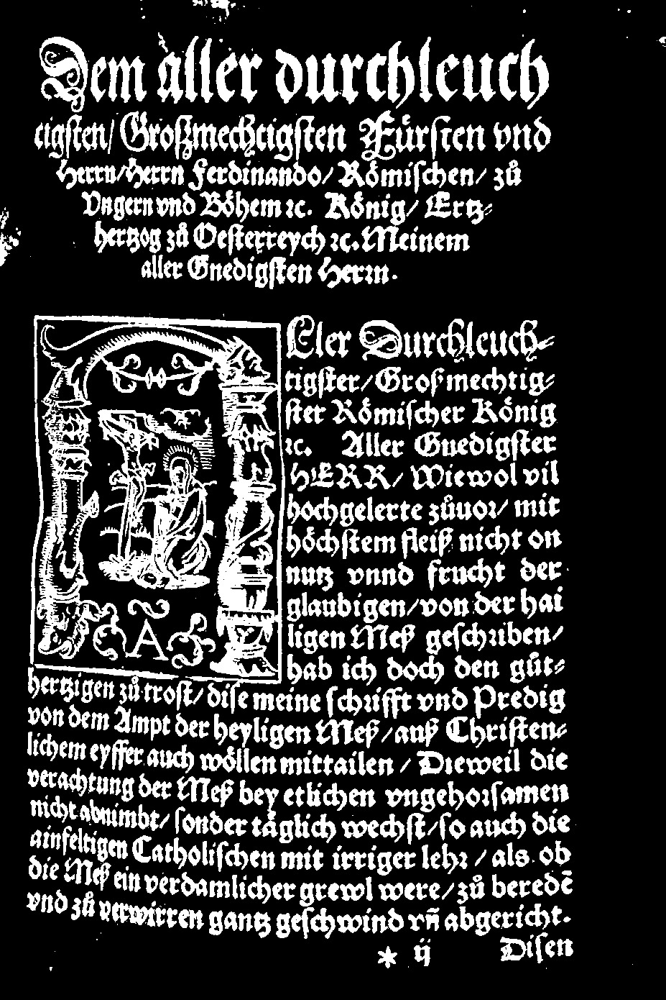
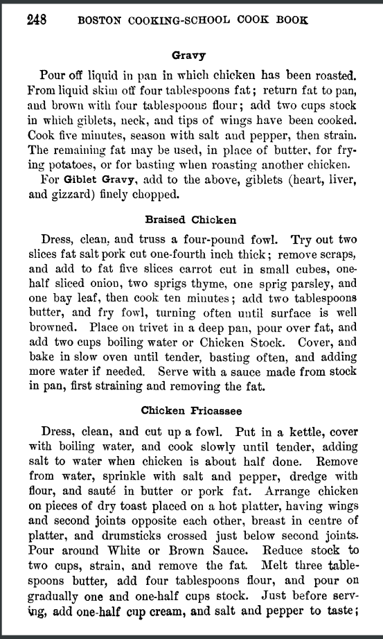
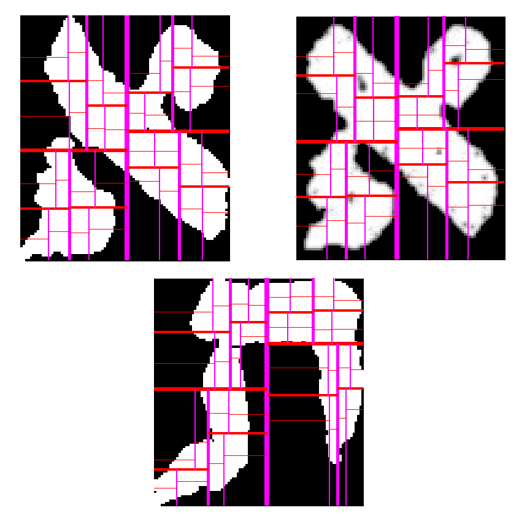
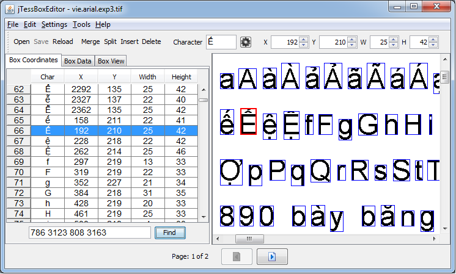

layout: true
  
<div class="my-footer">
  <table>
    <tr>
      <td style="text-align:left"><a href="http://ocr-d.github.io/slides/2019-03-25-dhd">http://ocr-d.github.io/slides/2019-03-25-dhd</a></td>
      <td style="text-align:right"><a href="https://ocr-d.de">OCR-D@DHd2019</a></td>
    </tr>
  </table>
</div>

---

class: title-slide

# OCR-D@DHd2019 - Was ist OCR?

| Konstantin Baierer                                                                   |
| :-------------------------------------------:                                        |
| [konstantin.baierer @gmail.com](mailto:konstantin.baierer@gmail.com) |

## &nbsp;

## [http://ocr-d.github.io/slides/2019-03-25-dhd](http://ocr-d.github.io/slides/2019-03-25-dhd)

---

# "Optical Character Recognition" #1

* Im engeren Sinne:

  > Maschinelle Erkennung einzelner Zeichen


- Mit 99% Wahrscheinlichkeit der Unicode-Glyph `0x31`

---

# OCR als Teil der Digitalisierung


---

# "Optical Character Recognition" #2

  > Workflow um auf Grundlage eingescannter Rasterbilddaten Layout und Inhalt
  > eines Dokuments möglichst wirklichkeitsgetreu mit Markup abzubilden

---

# "Workflow"

  > **Workflow** um auf Grundlage eingescannter Rasterbilddaten Layout und Inhalt
  > eines Dokuments möglichst wirklichkeitsgetreu mit Markup abzubilden

1. Vorverarbeitung
2. Layout- und Texterkennung
3. Nachkorrektur
4. Ggf. Strukturerkennung

---

# "eingescannter Rasterbilddaten"

  > Workflow um auf Grundlage **eingescannter Rasterbilddaten** Layout und Inhalt
  > eines Dokuments möglichst wirklichkeitsgetreu mit Markup abzubilden

- Hochauflösend, mind. 300 dpi
- Unbearbeitet, unkomprimiert, verläsliche technische Metadaten
- vgl. [DFG-Praxisregeln]()

---

# "Layout" grob

  > Workflow um auf Grundlage eingescannter Rasterbilddaten **Layout** und
  > Inhalt eines Dokuments möglichst wirklichkeitsgetreu mit Markup abzubilden

- Seite vs. Hintergrund
- Druckbereich vs. Rand
- Text vs. Nicht-Text

---

# "Layout" fein

  > Workflow um auf Grundlage eingescannter Rasterbilddaten **Layout** und
  > Inhalt eines Dokuments möglichst wirklichkeitsgetreu mit Markup abzubilden

- Klassifikation der Blöcke (bspw "Marginalie", "Tabelle")
- Spalten und andere grobe Strukturen
- Zeilen

---

# "Inhalt"

  > Workflow um auf Grundlage eingescannter Rasterbilddaten Layout und
  > **Inhalt** eines Dokuments möglichst wirklichkeitsgetreu mit Markup abzubilden

- Innerhalb von Zeilen
- Ggf. nach Worten und oder Zeichen segmentiert
- Kodieren der Zeichen in Unicode

---

# "Dokuments"

  > Workflow um auf Grundlage eingescannter Rasterbilddaten Layout und
  > Inhalt eines **Dokuments** möglichst wirklichkeitsgetreu mit Markup abzubilden

- Gedruckte Schrift, nicht Handschriften
- Monographien
- perspektivisch: Zeitungen

---

# "möglichst wirklichkeitsgetreu"

  > Workflow um auf Grundlage eingescannter Rasterbilddaten Layout und
  > Inhalt eines Dokuments **möglichst wirklichkeitsgetreu** mit Markup abzubilden

- Evaluation der Qualität der OCR
- Feedback zur Verbesserung
- Computerlinguistische Methoden

---

# "Markup"

  > Workflow um auf Grundlage eingescannter Rasterbilddaten Layout und Inhalt
  > eines Dokuments möglichst wirklichkeitsgetreu mit **Markup** abzubilden

- XML-basiert: ALTO, **PAGE-XML**, ABBYY XML
- HTML-basiert: hOCR
- Als Containerformat: METS

---

# OCR weithin interessant


<!-- }}} -->

---

# Historischer Abriss - Accessibility

  * Ideen und Prototype schon im 19. Jhdt
  * 1931: "Statistical Machine" (Emanuel Goldberg) (erkennt einfache Muster für Retrieval
  * 1951: "Gismo" (Shephard) erkennt Morse und einfache Lettern
  * 1962: "Optacon" (Linvill) übersetzt Buchstaben in Textur
  * 1976: Omnifont-OCR und Flachbettscanner (Kurzweil)

---

# Historischer Abriss - Automatisierung

  * 1945: Vannevar Bush's as "As we may think"
  * 1949: Barcode (Woodland)
  * 1954/1964: Reader's Digest: OCR für Buchungen und Post
  * 1968: <span style="font-family: 'OCR-B'">Schriftarten OCR-A/B für Etiketten, Ausweise uvm.</span>

---

# Historischer Abriss - OCR Software

  * 1985: Ur-Version von Tesseract, heute führende Open Source OCR
  * 1998: LeCun et al: OCR mit neuronalen Netzen
  * 2003: ABBYY mit Fraktur-Modell (METAe Projekt)
  * 2005: Google kauft und open sourcet Tesseract
  * 2007: Ur-Version von OCRopus, Pionier in anwendbarer OCR auf RNN-Basis
  * 2018: Tesseract 4 basierend auf neuronalen Netzen

---

# Historischer Abriss - GLAM

  * 2005: Europeana als Idee
  * 2010: Deutsche Digitale Bibliothek
  * 2009: DFG-Praxisrichtlinien und DFG Viewer
  * 2008-2012: IMPACT Projekt (Improving Access to Text)
  * seit 2015: **OCR-D (Koordinierungsprojekt zur Weiterentwicklung von Verfahren
  der Optical Character Recognition)**
  * seit 2016: READ (Recognition and Enrichment of Archival Documents)

---

# Historischer Abriss - OCR für die Massen

  * 1999: Grazer Buchtisch in Göttingen für Bibel Digital
  * 2000: Project Gutenberg Distributed Proofreaders
  * 2003: Wikisource
  * 2004: Google Books 
  * 2006: Open Library
  * 2009: DIY Book Scanner
  * 2011: IIIF (International Image Interoperability Framework)
  * heute: Alle Cloudanbieter machen OCR

---

# Vorverabeitung

1. Cropping (Abschneiden der Ränder)
2. Binarisierung (Farbig zu schwarz weiss)
3. Despeckling (Entferne von "Fliegendreck" u.ä.)
4. Dewarping (Entzerren von Wellen und dgl.)


---

# Binarisierung

* Erhebliche Bedeutung für die weitere Verarbeitung
* Gut erforschtes Feld aber in der Praxis noch viel Optimierungsbedarf
* Open Source Werkzeuge für Bildvorverarbeitung
  * Image Magick (`convert`)
  * Leptonica (Bibliothek, in tesseract enthalten)
  * OpenCV (Bibliothek, weit verbreitet)
  * OLENA/scribo (`scribo-cli`)
  * kraken (`kraken binarize` Teil der kraken Engine)
  * Scan Tailor (`scantailor`) GUI für das OCR-Preprocessing

---

# Binarisierung - Image Magick

<center>

</center>

```sh
# Rein schwellwert-basierte Binarisierung mit Image Magick
convert INPUT.jpg -threshold 40% OUTPUT.jpg

# Schwellwert-basierte Binarisierung mit den 2 Farben \
# die bildweit maximal unterschiedlich sind
convert OUTPUT.jpg +dither -colors 2 -colorspace gray \
  -normalize OUTPUT.jpg
```

<center>


</center>

---

# Sauvola's algorithm mit OLENA/SCRIBO und Varianten

```sh
scribo-cli sauvola INPUT.jpg OUTPUT-sauvola.jpg
scribo-cli sauvola-ms INPUT.jpg OUTPUT-sauvola-ms.jpg
scribo-cli sauvola-ms-fg INPUT.jpg OUTPUT-sauvola-ms-fg.jpg
scribo-cli sauvola INPUT.jpg OUTPUT-sauvola.jpg
scribo-cli sauvola INPUT.jpg OUTPUT-sauvola.jpg
```

<center>




</center>

---

# Binarisierung - kraken

```sh
# Binarisierung mi adaptivem Schwellwert mit kraken
kraken -i INPUT.jpg OUTPUT.jpg binarize
```

<p style="text-align: center;">

</p>

---

# Binarisierung - ocropus

```sh
ocropus-nlbin INPUT.JPG INPU2.JPG
```

<p style="text-align: center">
  
  
</p>

---

# Cropping/Deskewing/Dewarping

* Dewarping ist ein komplexes Problem und Gegenstand der Forschung
* Scantailor bietet hervorragende Möglichkeiten, semi-automatisch zu bearbeiten

<p style="text-align: center">



</p>

---

# Segmentierung

<p style="text-align: center">

<br/>
<a href="http://www.larex-webapp.informatik.uni-wuerzburg.de/">Vielversprechendes Tool der Kollegen aus Würzburg</a>
</p>

---

background-image: url(figures/standards.png)

---

# Interlude: OCR-Formate

* OCR-Daten werden in XML gespeichert:
  * Koordinaten
  * Textinhalte
  * Annotationen ("Tabelle")
  * Reading Order
  * . . .

* Kompliziert aber nicht wirklich komplex

---

# Interlude: OCR-Formate

* Es gibt eine überschaubare Anzahl von OCR-Entwicklern. Und doch:
  * `hOCR`
  * `PAGE-XML`
  * `ALTO`
  * `ABBYY-XML`
  * `DjVu`
  * `Text` + `JSON`
  * Binärkodierung in den Bildern selbst

* Aber: Einigung in Sicht

---

# Interlude: Container-Formate

* METS für Digitalisierungs-Workflows
* IIIF für User Interfaces

<center>


</center>

---

# Segmentierung

<p style="text-align: center">


</p>

* Funktionalität zum Segmentieren vorhanden in
  * Ocropus
  * Kraken
  * Tesseract
  * Leptonica
  * ...
* Aber nicht ohne weiteres direkt zugänglich
  * => OCR-D-Wrapper

---

# OCR im engeren Sinne

* Evolution der technischen Lösungen

1. Regel-/Template basiert
  * GOCR, Cuneiform, Ocrad
1. Maschinelles Lernen (seit 1990ern)
  * Tesseract, ABBYY, OmniPage
1. Deep Learning (seit 2010)
  * Ocropus, kraken, calamari, Google

---

# Regelbasierte OCR

* Programmierer legt fest
  * "was ein a ist"
  * "wo Text stehen darf"
  * "ob das eine `0` oder ein `O` ist"

* Stark schriftart- und dokumentabhängig
* Für bestimmte Zwecke aber nützlich
  * Gleichartige Formulare
  * Barcodes
  * OCR-A/OCR-B Schrift
  * Anti-CAPTCHA

---

# Regelbasiert - Ocrad und GOCR


<table>
<tr>
<th>
GOCR
</th>
<th>
ocrad
</th>
</tr>

<tr>
<td>
<pre>
$ convert PR8_GT.tiff pbm:- |gocr -i -

evidence, and shall _nally hear and d
m_tter brought before _hem, in _he m
and expeditious manner; and in  c_se
shall be convicted ofan.y crime, ror w
the offender ought to su_er death, tl_e
shall give J_dgment, an_ awar_ and ca
</pre>
</td>

<td>
<pre>
$ convert PR8_GT.tiff pbm:- |ocrad

evidence, and shallfinally hear and d
matter brought before _hem, in Lhe m
and expeditious manner; and in chse
shall be convicted ofan.y crime, for w
the orFender ought to su_er death, tlle
sh_ll give j_ldgmellt, an_ awar_ and c_
</pre>
</td>
</tr>
</table>

---

# Regelbasiert: Cuneiform

* Abandonware
* Für ihre Zeit überraschend featurereiche Software

<pre>
$ cuneiform -o /dev/stdout -f smarttext PR8_GT.tiff.png 

evidence, and shall finally hear and d 
matter broughtbefore them, in the m 
and expeditious manner; and in case 
shall be convicted of any crime, for w 
the offender ought to suffer death, the 
shall give judgment, and award and ca
</pre>


---

# Maximal plattformübergreifend

* Mittels emscripten/WebAssembly heute im Browser nutzbar:

<table>
  <tr>
    <th>ocrad.js</th>
    <th>gocr.js</th>
  </tr>
  <tr>
    <td style="text-align: center">
      <a href="demo-ocrad.html">
        
      </a>
    </td>
    <td style="text-align: center">
      <a href="demo-gocr.html">
        
      </a>
    </td>
  </tr>
</table>

* Geht auch mit Tesseract (3)!
* http://projectnaptha.com/

---

# Interlude: CAPTCHA

* CAPTCHA sind Anti-Turing-Tests, die nur Menschen lösen können sollen

<div style="text-align: center">

</div>

* Kann demaskiert werden und mit OCR erkannt, von Maschinen lösbar

---

# CAPTCHA mit Bildern

* Bildklassifikation ist ein gängiges Forschungsthema, auch von
  Maschinen lösbar

  <div style="text-align: center">
  
  </div>

---

# CAPTCHA über User Interface


---

# CAPTCHA: Guess what :-)

<video width="641" height="360" poster="figures/robot-vs-captcha.jpg" controls>
  <source src="figures/i.am.not.a.robot.mp4" type="video/mp4"/>
</video>

http://geekologie.com/2017/01/robotic-arm-beats-i-am-not-a-robot-captc.php

---

# Word spotting

* Segmentierung und Clustern von Wörtern
* Eher Notlösung, aber hilfreich als Orientierung oder in Kombination


http://ciir.cs.umass.edu/irdemo/hw-demo/wordspot_retr.html

---

# Feature Extraction

* Extrahieren von Eigenschaften aus Teilbereichen des Bildes
  * Position in Netzstruktur
  * Farbhistogramm
  * Pixelübergänge
  * Kanten

<p style="text-align: center" height="300">


</p>

---

# Maschinelles Lernen

- Wird seit 50 Jahren erforscht
- Ziel: Muster in Daten erkennen
- Vielzahl von Arten von Algorithmen
- Relevant für OCR:
  - Supervised
  - "Feedback-Schleifen"
  - Neuronale Netze

---

# Supervised Machine Learning

  - Manuell annotierte Eingabedaten ("Ground truth")
  - Training eines Algorithmus auf diesen Daten
    - Extraktion von Features
    - Verteilung von "Gewichten" für gewünschte Ausgabe
    - Ergebnis: Modell
  - Anwenden des Modells auf neue Daten

Hauptsächlich: Support Vector Machines (SVM) und verwandte Algorithmen zur
Klassifikation

<p style="text-align: center">

</p>

---

# OCR-Engines mit "flachem" ML

* Erwarten Segmentierung bis auf Ebene der einzelnen Zeichen
* Enthalten umfangreiche Sprachmodelle (bspw. Lexika)
* Sind mit sehr vielen Schriften trainiert
* Erlauben das Trainieren der Muster für die einzelnen Zeichen

<p style="text-align: center">


</p>

---

# Feedback-Schleifen

* In gewachsenen Systemen wie Tesseract und ABBYY stecken hunderte
  Optimierungen und non-lineare Abläufe
* Passen Verhalten an um sich einem Optimum anzunähern
* Macht Systeme wie Tesseract3 oder ABBYY schwer anpassbar

<p style="text-align: center">

</p>

---

# Deep Learning

* Neuronale Netze seit Jahrzehnten
* Modellieren von Prozessen, die nicht direkt algorithmisch lösbar sind
* "Deep": Mehrere Ebenen von interagierenden Komponenten, die vorwärts und
  rückwärts kommunizieren können

<p style="text-align: center">

</p>

---

background-image: url(figures/image_classification_006.png)

# ImageNet competition 2012

---

# Mainstreaming von Deep Learning

* Open Source Frameworks wie tensorflow, keras, pytorch uvm.
* Big Player involviert: Google, Microsoft, NVIDIA, Yandex, Baidu ...
* OCR als "einfaches" Problem häufig bearbeitet


---

# Deep Learning OCR

* Arbeitet nicht auf Zeichen sondern ganzen Zeilen
* Kann mit relativ wenig Ground Truth passgenau auf ein Dokument trainiert werden
* Erreicht korrekt konfiguriert extrem hohe Erkennungsgenauigkeien
* Open Source Lösungen
  * Ocropus
  * kraken
  * tesseract4
  * calamari

---

# OCRropus lernt eine Zeile


<iframe width="800" height="500" src="https://www.youtube.com/embed/czG5Jk9iC7c" frameborder="0" allow="accelerometer; autoplay; encrypted-media; gyroscope; picture-in-picture" allowfullscreen></iframe>

---

# Le-Net rät korrekt was gemeint ist


---

# Sprachen - indogermanisch


---

background-image: url(figures/indicf.jpg)


---

background-image: url(figures/languages-in-asia.jpg)

---

# Deep Learning + Unicode = 👍😍

* Unicode ist heute Standard
* Nicht-romanische Sprachen
* Nicht-lateinische Schriften
* Nicht-segmentierte Schriften

* => Großes Engagement insbesondere auch asiatischer Enwickler*innen

---

# Nachkorrektur

* Untersuchung mit computerlinguistischen Methoden
* Schwierigkeit:
  * OCR-Fehler von heute unüblicher Schreibweise unterscheiden
* Fehler die **vor** der OCR passiert sind:
  * "Hand auf der Scanvorlage"
  * Segmentierungsfehler
  * Sprach- oder Schriftwechsel innerhalb des Werkes usw.
* Kombinieren von OCR-Ergebnissen und Voting
* Ground-Truth-freie Ansätze damit solche Nachkorrektur auch skalieren

---

# Was alles schief laufen kann

<iframe width="760" height="515" src="https://www.youtube.com/embed/Jas0bwDdEzs" frameborder="0" allow="accelerometer; autoplay; encrypted-media; gyroscope; picture-in-picture" allowfullscreen></iframe>

---

# Wie merkt man das

* Klassisch: Zeichenbasiert mit Levenshtein-Distanz
* Vergleich von annotiertem und erkanntem Text:
  * __n__ Fehler für jedes eingefügte/gelöschte Zeichen
  * __n__ Fehler für jedes falsch erkannte Zeichen
  * __n__ Fehler für getauschte benachbarte Buchstaben
  * wobei __n__ üblicherweise 1
* Character error rate (CER):
  * Anzahl der Fehler geteilt durch Anzahl der Zeichen
  * DFG-Praxisrichtlinien: auf jeden Fall `< 5%` CER.
* Word error rate (WER):
  * Anzahl der Worte mit CER > 0 geteilt durch Anzahl der Worte

---

# Beispiel

<p style="text-align: center">
  
</p>

* CER: `2 / 20 == 10%`
* WER: `2 / 20 == 10%` (oder `0` weil Komma ja kein Wort ist)

---

# Erfahrungsgemäß

* Fehler in Titelseiten sind erwartbar aber nicht relevant
* Fehler in Tabellen (bspw. Steuereinnahmen) sind sehr problematisch
* Anwendungsspezifisch:
  * Linguistische Auswertung
  * Negativsuche
  * Phrasensuche
  * Positivsuche
* Eng verknüpft mit dem Problem der Nachkorrektur
* Zeichengenauigkeit schwer messbar
* Wortgenauigkeit subjektiv wichtiger

---

# OCR Community

* OCR, Ziffern und Handschriftenerkennung ein beliebtes Problem
* Jährliche Challenges bei [ICDAR](http://u-pat.org/ICDAR2017/program_competitions.php) und DAS
* Rege Entwickler-Community auf GitHub
* Bibliotheken engagieren sich zunehmend direkt in der Entwicklung
* Selbst wenn der Deep Learning Hype wieder abflaut, profitieren Kultureinrichtungen nachhaltig

---

# Vielen Dank

<center>

</center>

Links zu Open Source OCR: [github.com/kba/awesome-ocr](https://github.com/kba/awesome-ocr))
Links zu freier Ground Truth: [github.com/cneud/ocr-gt](https://github.com/cneud/ocr-gt))

<center>
https://ocr-d.de
</center>

<center>
https://ocr-d.github.io
</center>

<center>
https://github.com/OCR-D
</center>
