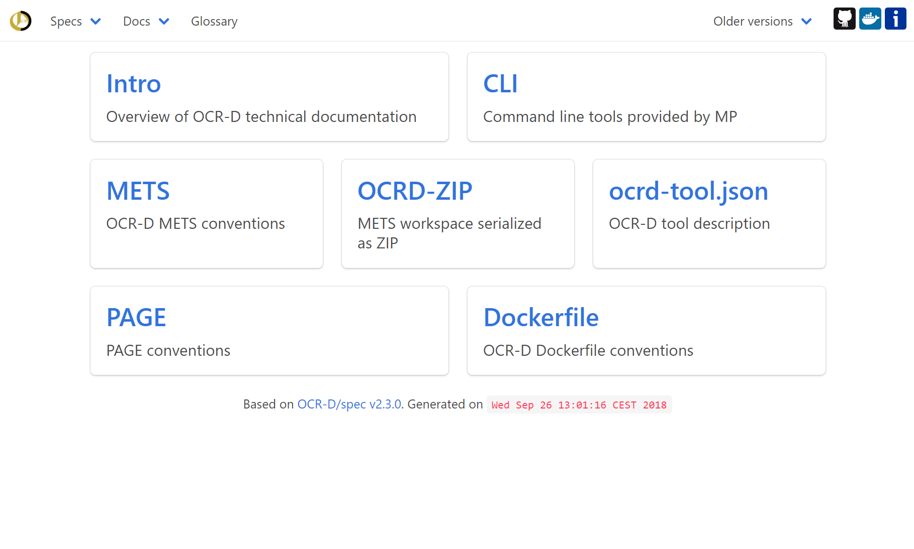

layout: true
  

  <table>
    <tr>
      <td style="text-align:left"><a href="http://ocr-d.github.io/slides/2019-03-25-dhd">http://ocr-d.github.io/slides/2019-03-25-dhd</a></td>
      <td style="text-align:right"><a href="https://ocr-d.de">OCR-D@DHd2019</a></td>
    </tr>
  </table>

---

class: title-slide

# OCR-D@DHd2019 - OCR-D Spezifikationen und Software

| Konstantin Baierer                                                                   |
| :-------------------------------------------:                                        |
| [konstantin.baierer @gmail.com](mailto:konstantin.baierer@gmail.com) |

## &nbsp;

## [http://ocr-d.github.io/slides/2019-03-25-dhd](http://ocr-d.github.io/slides/2019-03-25-dhd)

---

# Übersicht

* Projektphilosophie
* Spezifikationen
* Software
* Support

---

# Projektphilosophie

* Transparenz in Entwicklung und Kommunikation
* Spezifikation > Implementierung
* Standards nachnutzen
* "Upstream/Downstream" beitragen wenn möglich

---

# Spezifikationen

https://ocr-d.github.io

---

# Vielen Dank

Links zu Open Source OCR: [github.com/kba/awesome-ocr](https://github.com/kba/awesome-ocr))
Links zu freier Ground Truth: [github.com/cneud/ocr-gt](https://github.com/cneud/ocr-gt))

https://ocr-d.de

https://ocr-d.github.io

https://github.com/OCR-D

