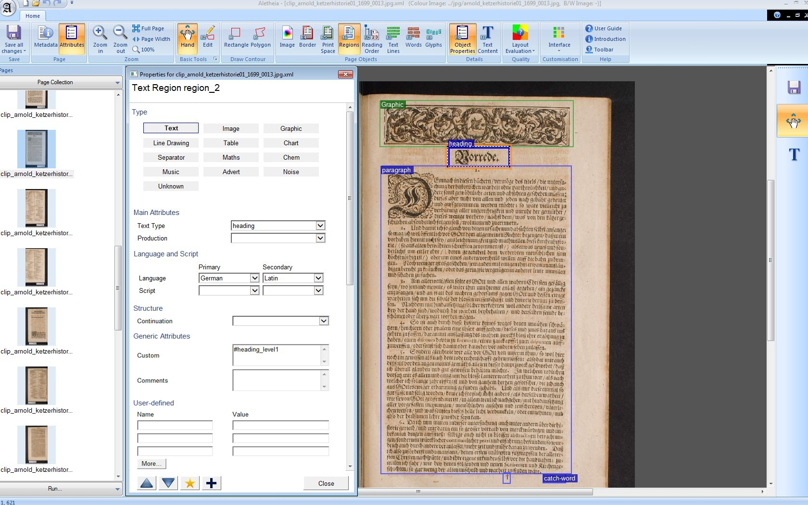
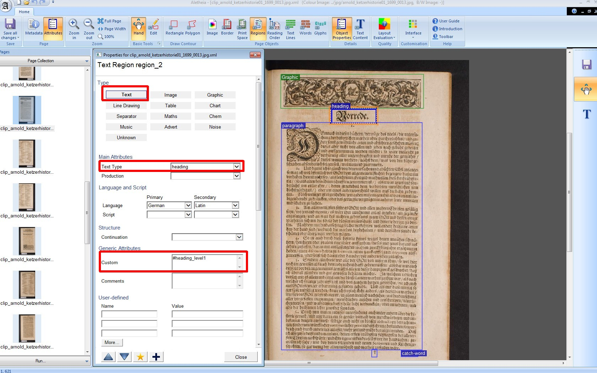
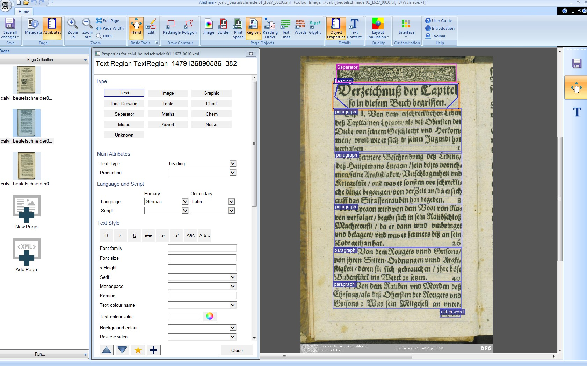
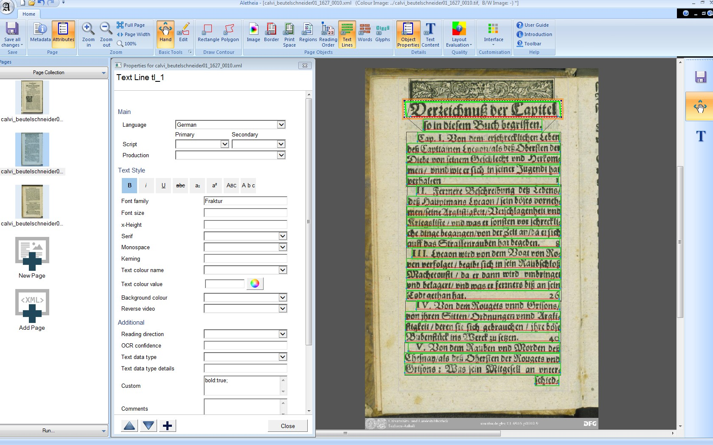
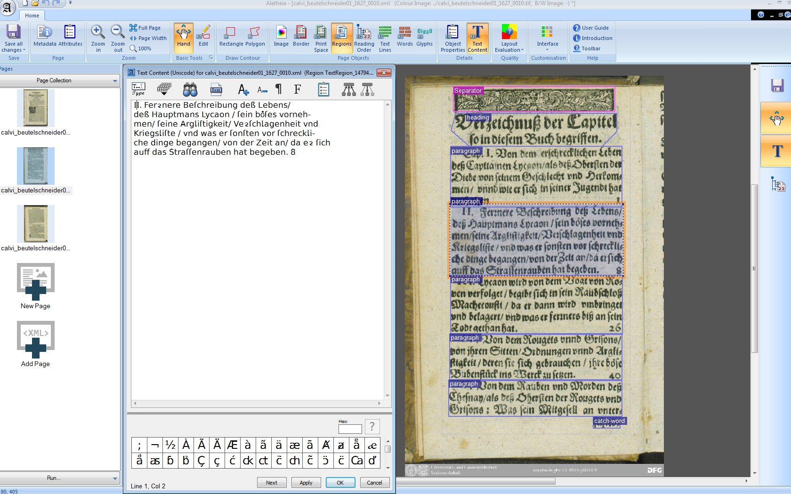

layout: true
  
<div class="my-header"></div>

<div class="my-footer">
  <table>
    <tr>
      <td>PhilTag 2018</td>
      <td style="text-align:right"><a href="https://www.dwds.de">Neues aus OCR-D</a></td>
    </tr>
  </table>
</div>

---

class: title-slide

# Neues aus OCR-D  

| Kay-Michael Würzner |
|:-------------------:|
| [wuerzner@bbaw.de](mailto:wuerzner@bbaw.de) |

---

# Überblick

- OCR-D-Framework (Konstantin Baierer, Volker Hartmann, Clemens Neudecker)
- OCR-D-Ground-Truth (Matthias Boenig, Maria Federbusch)
- Training mit Tesseract 4 (Uwe Springmann)

---

# OCR-D

- DFG-gefördertes Koordinierungsprojekt
   + Ziele:
        * Verbesserung von OCR-Methoden für historische Drucke (16. - 19. Jh.)
        * technische Vorbereitung der Volltextdigitalisierung der in den VDs (16, 17, 18) verzeichneten Drucke
   + Laufzeit:
        * September 2015 - Oktober 2018 (Verlängerung beantragt)
   + Ablauf:
        1. Identifikation technischer und wissenschaftlicher Bedarfe
        2. Konzeption und Formulierung einer Ausschreibung für Modulprojekte (MPs) zu deren Bearbeitung
        3. Entwicklung einer Koordinierungsstruktur
        4. Betreuung der MPs
        5. Integration der MP-Entwicklungen in einen produktiven Workflow

---

# Modulprojektphase

- Modulprojektphase seit 01/2018
    + acht Modulprojekte in fünf inhaltlichen Bereichen
    + Bildvorverarbeitung:
        * *Bildoptimierung* (DFKI Kaiserslautern)
    + Layouterkennung:
        * *Layouterkennung* (DFKI Kaiserslautern)
        * *Weiterentwicklung LAREX* (JMU Würzburg)
    + Textoptimierung:
        * *Tesseract im OCR-D-Workflow* (UB Mannheim)
        * *Unüberwachte Nachkorrektur mit neuronalen Netzen und FSTs* (Uni Leipzig)
        * *Automatische Nachkorrektur mit PoCoTo* (LMU München)
    + OCR-Training:
        * *Modellrepositorium und automatische Schriftarterkennung* (FAU Erlangen, JGU Mainz, Uni Leipzig)
    + Langzeitarchivierung:
        * *Langzeitarchiv für historische Drucke* (SUB Göttingen)

---

class: title-slide

# OCR-D-Framework

<center>
Baierer, Hartmann, Neudecker, Würzner
</center>

---

#  Grundzüge

- Ziele:
    1. Integration der Ergebnisse der Modulprojekte
        * wohldefinierte Schnittstellen
        * etablierte Austauschformate
    2. Komplettierung mit Infrastrukturkomponenten zur Orchestrierung bzw. Ausbau zum vollwertigen Workflow
        * Validierung von Daten und Komponenten
        * Discovery der integrierten Dienste
        * Containerisierung
        * Formatkonvertierung
        * File-Cache
        * *Forschungsdatenrepositorium*
- Ansprache der MP-Software via REST und/oder CLI
- Orchestrierung mit Hilfe von `Apache Taverna`

---

# Eigenentwicklungen

- [OCR-D/spec](https://github.com/OCR-D/spec)
    + Formale Specs für CLI, HTTP API, Discovery
- [OCR-D/core](https://github.com/OCR-D/pyocrd)
    + Implementierung der Schnittstellen, Helpers und Experimente in `Python`
    + CLI für wiederkehrende Aufgaben
        * Arbeit mit METS/PAGE
        * Resolver (Caching, Persistenz, Transformation von Dateien/URL)
        * Validierung
    + Bereich für Entwickler
    + Illustration der Schnittstellen
- [OCR-D/ocrd_tesserocr](https://github.com/OCR-D/ocrd_tesserocr)
    + Referenzimplementierung der Interfaces (Apache 2.0, im Aufbau)

---

# Formate

- Überblick:
    + Fokus für die Verarbeitung von Anfang an: **Massendigitalisierung**
    + Dokumentation und Beispiele: https://github.com/OCR-D/spec/
    + METS als Austauschformat
        * `fileGrp` für Referenzen auf Quell- und (Zwischen-)Ergebnisdateien
        * `fileGrp@USE`-Attribute zur Kenntlichmachung
    + METS für Ergebnisse auf **Dokumentebene**
        * `structMap TYPE=logical` für Dokumentstruktur
    + PAGE für Ergebnisse auf **Seitenebene**
    + JSON für **Parameterübergabe** und **Interfacebeschreibung**
    + ALTO als **Exportformat** (verlustbehaftet!)

---

# Warum METS?

- Standardarbeitsformat in **Bibliotheken** und DFG-Richtlinien
- Standardausgabeformat von **Digitalisierungsdienstleistern**
- Anschluss an Präsentations-, Archiv- und Katalogsysteme
- umfangreicher Satz an Meta- und Primärdatenfeldern
- **Anschlusspunkt** an vorhandene Digitalisierungsworkflows

---

# Warum PAGE (und nicht ALTO)?

- speziell für die **granularen** Bedürfnisse der Repräsentation von Ergebnissen der Text- und Strukturerkennung konzipiert
    + etabliert im Rahmen von wissenschaftlichen Wettbewerben
    + Erweiterung des Standards mit ausreichender Dynamik möglich
    + Zusammenarbeit am Format mit PRImA Research Lab und READ
- METS/ALTO als **Standardformatkombination** in Bibliotheken
    + Beschreibungsinventar (noch) nicht ausreichend für OCR-D
    + andauernde Evaluation PAGE vs ALTO, **Transformationsszenarien**
    + offene Entwicklung und Erweiterung via https://github.com/altoxml

---

class: title-slide

# OCR-D-Ground-Truth

<center>
Boenig, Federbusch, Würzner
</center>

---

# Überblick

- Erstellung von **Referenzdaten** innerhalb von OCR-D
    + repräsentatives Bild der Phänomenlage in den VDs
    + vollständige Erfassung in Text und Struktur
- Formulierung von **Erfassungsrichtlinien**
    + Konsolidierung der Formatanforderungen
    + Formatdokumentation
    + Handlungsanweisung für die GT-Erstellung
    + Operationalisierung der Überprüfbarkeit der Validität
- Kritik: Umfang für Training **nicht aussreichend**

---

# Erweiterung

- Ausweitung des GT-Bestands um **Strukturdaten aus dem Deutschen Textarchiv**
    + erhoben im Vorfeld der manuellen Transkription
    + zur Erfassung der Phänomenbereiche auf Werkebene
    + rechteckige Regionen
    + keine vorhergehende Bildoptimierung 
- **heuristische Auswahl** vollständig strukturierter Seiten
    + Anzahl der Regionen
    + Verhältnis der Gesamtabdeckung zur Seitengröße
    + *precision*-orientiert
- Konvertierung nach PAGE
    + Überschriftenhierarchie zunächst als Kommentar

---

# Beispiel

.center[]

---

count:false

# Beispiel

.center[]

---

# Umfang

- zwei Lieferungen an die Kollegen an Würzburg zur Abstimmung
    + Lieferung 1 (Publikationszeitraum von ca. 1750 - 1900): 
      12&#x202f;275 Seiten aus 614 Titeln
    + Lieferung 2 (Publikationszeitraum von ca. 1600 - 1750): 
      13&#x202f;200 Seiten aus 545 Titeln
- bisher **nur Strukturinformationen**
    + Text/Nicht-Texttrennung (*page segmentation*)
    + Segmentklassifizierung (*region classification*)
    + auch für Bildbeschneidung (*cropping*) geeignet

---

# Perspektive

- Integration der zugehörigen **Volltextdaten**
    + Rückbindung an Struktur nicht vorhanden
    + Zeilen nicht gezont
    + TEI-Repräsentation nicht notwendigerweise mit Struktur synchron
- **heuristisches** Verfahren nötig
    + manuelle Abbildung in vollem Umfang **nicht leistbar**
    + Rezept:
        * Abbildung der TEI-Strukturrepräsentation
        * automatische Zeilenerkenung auf Regionenebene
        * Integration der Volltextzeilen in die Strukturzeilen
    + **Verlust** der Seite bei Regionen- oder Zeilendiskrepanz

---

# Beispiel

.center[]

---

count:false

# Beispiel

.center[]

---

count:false

# Beispiel

.center[]

---

# Perspektive

- unvollständige Strukturierung auf Seitenebene
    + entsprechende Seiten als **Evaluationsdaten** verwendbar
- **aber** vollständige Erfassung der Überschriftenhierachie
    + wertvolle Ground Truth für Dokumentenanalyse
- in Vorbereitung außerdem
    + Dramenkorpus (nur Struktur) aus DTA-Bestand (BBAW)
    + weitere grundständig erfasste, vollständige Daten inklusive polygoner Zonen (SBB)

---

class: title-slide

# Training Tesseract 4

<center>
Springmann, Würzner
</center>

---

# Ausgangslage

- Tesseract 4 galt lange als nur mit **synthetischen Daten** trainierbar
    + Dokumentation zwar mit Hinweis auf *labelling some pre-existing images*
    + aber:
        * Skripte ohne entsprechende Optionen
        * `box files` für Zeilenrepräsentation *not yet implemented*
        * *These instructions only cover the case of rendering from fonts, ...*
        * *The only supported option is to use synthetic training data created by tesstrain.sh script using training text and unicode fonts.*
- Trainingsskripte unnötig komplex, mit vielen impliziten Annahmen

---

# Motivation

- Tesseract die **verbreitetste, frei verfügbare OCR-Engine**
    + Unterstützung in OCR-D als Ziel
- zwei Optionen:
    1. synthetisches Training
        * Generierung von Zeilenbildern aus Volltext und Computerschriftarten per **Fontrendering**
    2. Testen, ob es vielleicht doch geht...
- Training mit synthetischen Daten für historische Vorlagen mit hoher Zeichendarstellungsvarianz bisher nicht erfolgreich
- also Option 2: 
  Analyse des mitgelieferten Skripts `tesstrain.sh`

---

# Rezept

- Zutaten:
    + TIF-Version der Digitalisate
    + passender fehlerfreier Volltext
    + Alignierung auf Zeilenebene
    + Tesseract 4
- Vorgehen:
    - Generierung von `box files`
        + eine Zeile pro Zeichen im GT & Koordinaten der **ganzen Zeile**
        + EOL-Marker `TAB STOP` & Koordinaten **rechte untere Ecke** 
          ```
          n 0 0 1232 49 0
          e 0 0 1232 49 0
          n 0 0 1232 49 0
          	1232 49 1233 50 0
          ```

---

# Rezept

- Vorgehen:
    + Generierung eines Codecs 
      ```sh
      unicharset_extractor \
      	--output_unicharset Fraktur.unicharset \
      	--norm_mode 1 *.box
      ```
        * entspricht einer Alphabet-Definition
    + Generierung von `lstmf files`
      ```sh
      for i in `ls *.tif`;do
      base=`basename $i .tif`
      	tesseract $i $base lstm.train
      done
      ```
        * Tesseract-eigenes Binärformat

---

# Rezept

- Vorgehen:
    + Generierung eines Proto-Modells
      ```sh
      combine_lang_model \
      	--input_unicharset Fraktur.unicharset \
      	--script_dir /home/kmw/built/langdata
      	--output_dir tmp/ \
      	--lang Fraktur
      ```
        * Definition der Struktur des Modells
    + Aufteilung in Trainings- und Evaluationsdaten
        * erfolgt nach der Konstruktion von `box` und `lstmf files`
        * jeweils Liste mit *one file per line* nötig

---

# Rezept

- Vorgehen:
    + Modelltraining
      ```sh
      lstmtraining \
      	--traineddata tmp/Fraktur/Fraktur.traineddata \
      	--net_spec \ 
        '[1,36,0,1 Ct3,3,16 Mp3,3 Lfys48 Lfx96 Lrx96 Lfx256 O1c61]'
      	--model_output out/base \
      	--learning_rate 20e-4 \
      	--train_listfile Fraktur.training_files.txt \
      	--eval_listfile Fraktur.test_files.txt \
      	--max_iterations 30000
      ```
        * `net_spec`: entspricht Netzwerkarchitextktur, [Variable-size Graph Specification Language](https://github.com/tesseract-ocr/tesseract/wiki/VGSLSpecs)
        * `O1c61`: Festlegung der Ausgabeklassen ≡ Alphabetgröße
        * Ausgabe von *checkpoints* während des Trainings

---

# Rezept

- Vorgehen:
    + Modellabschluss
      ```sh
      lstmtraining \
      	--stop_training \
      	--continue_from out/base_checkpoint \
      	--traineddata tmp/Fraktur/Fraktur.traineddata \
      	--model_output out/Fraktur.traineddata
      ```
        * Konvertierung eines *checkpoints* in ein Modell
        * `traineddata`: Proto-Modell
    + Anwendung
      ```sh
      tesseract --tessdata-dir out/ -psm 13 -l Fraktur i.tif i
      ```

---

class: with-small-table

# Evaluation

- Test mit Daten aus dem Deutschen Textarchiv
    + Fraktur 19. Jahrhundert
    + ca. 30&#x202f;000 Zeilen Trainingsdaten
    + ca. 300 Zeilen Testdaten
- keine Lexika, keine Nachbearbeitung
- erstaunlich **schnelles** Training
    + 4000 Trainingsschritte in 1,5 h (vier Kerne)
    + kein nennenswerter RAM-Bedarf


| Trainingsschritte |      CER     |
| ----------------: | :----------- |
| 10000             | 3,6&#x202f;% |
| 15000             | 3,1&#x202f;% |
| 50000             | 1,4&#x202f;% |
| 80000             | 0,9&#x202f;% |
| 100000            | 0,7&#x202f;% |

---

# Perspektive

- Zeichenerkennung **besser** als mit OCRopy auf den gleichen Daten
- Kommunikation in Tesseract-Community, Aktualisierung der Dokumentation
- systematische Evaluation steht aus
    + mehr Testdaten
    + heterogenere Trainingsmenge
    + wirklich **herausfordernde** Daten
    + verschiedene Netzwerkarchitekturen
    + Einfluss von Lexika
- übergeordnete Frage: große generische vs. kleine spezifische Modelle

---

class: title-slide

# Danke für Ihre Aufmerksamkeit

<center>
https://ocr-d.de
</center>


<center>
https://github.com/OCR-D
</center>
